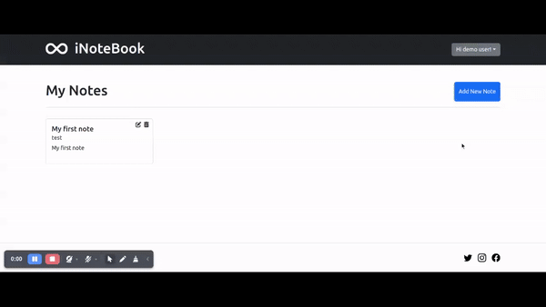

# iNoteBook

Welcome to the iNoteBook GitHub repository!

iNoteBook is a personal notes app built using the MERN stack (MongoDB, Express.js, React, Node.js). It provides users with the ability to sign up or log in securely. Once logged in, users can create, view, edit, and manage their personal notes efficiently.User authentication is handled using JSON Web Tokens (JWT).

## Features
- User Authentication: The app supports user registration and login functionality. Each user has a unique set of credentials to access their notes securely.
- Create and Edit Notes: Users can create new notes and edit existing ones. The app provides a user-friendly interface to compose and format notes with rich text editing capabilities.
- Store Notes: The notes created by users are securely stored in the backend database, ensuring data persistence and accessibility across multiple sessions.
- User-Specific Notes: Each user has their own set of notes associated with their account. This ensures privacy and organization for each user's personal notes.
- Search and Filter: The app allows users to search and filter their notes based on keywords or categories, making it easy to find specific information.
- Responsive Design: The frontend of the app is built using React, providing a responsive and interactive user interface that adapts to different devices and screen sizes.

## Tech Stack

**Client:** React, JSX, Bootstrap

**Server:** Node, Express

**Server:** MongoDB

**Authentication:** JSON Web Tokens (JWT)

